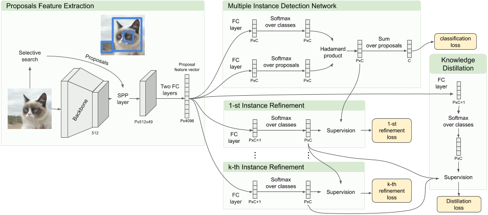
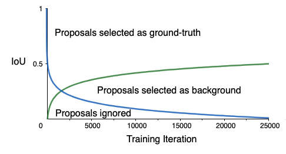
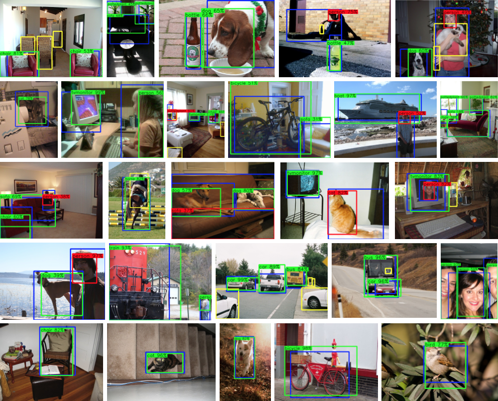

# Distilling Knowledge from Refinement in Multiple Instance Detection Networks (Boosted-OICR)
By [Luis Felipe Zeni](http://luiszeni.com.br/) and [Claudio Jung](http://www.inf.ufrgs.br/~crjung/).

**Institute of Informatics, Federal University of Rio Grande do Sul, Brazil**

This repository contains the PyTorch implementation of our paper [Distilling Knowledge from Refinement in Multiple Instance Detection Networks](https://arxiv.org/abs/2004.10943) published in Deep Vision 2020 CVPR workshop. (Go to Contents section if you are interested in how to run the code).

In this work, we claim that carefully selecting the aggregation criteria can considerably improve the accuracy of the learned detector. We start by proposing an additional refinement step to an existing approach (OICR), which we call refinement knowledge distillation. Then, we present an adaptive supervision aggregation function that dynamically changes the aggregation criteria for selecting boxes related to one of the ground-truth classes, background, or even ignored during the generation of each refinement module supervision. We call these improvements "Boosted-OICR". 

### News:

**17-sep-2020:** I returned the code to an old version. I made a considerable refactoring to release the code, and some of these changes impacted a little bit in the final mAP. As I am short on time, I decided to return the code to an older version (which is not beauty as the refactored one but have a better mAP in the end.). I also added a  reproducibility section in this document were I explain why the results are not the same after training with the same seed. 

**25-may-2020:** Finally we received the results from VOC 2012 evaluation server, and we beat C-MIl in detection mAP :). By best of my knowledge this is the best WSOD result in the VOC until now. http://host.robots.ox.ac.uk:8080/anonymous/E7JSMD.html 


### We made improvements in OICR's architecture

<p align="left">

</p>

### And also improved "le trick"
<p align="left">

</p>

### Some cool detection results visualizations

<p align="left">

</p>

### License

Our code is under the MIT License (refer to the LICENSE file for details).

### Citing Boosted-OICR

If you find our paper or our implementation useful in your research, please consider citing:

    @inproceedings{zeni2020distilling,
      title={Distilling Knowledge From Refinement in Multiple Instance Detection Networks},
      author={Felipe Zeni, Luis and Jung, Claudio R},
      booktitle={Proceedings of the IEEE/CVF Conference on Computer Vision and Pattern Recognition Workshops},
      pages={768--769},
      year={2020}
    }
    

### Contents:
1. [Requirements: software](#requirements-software)
2. [Requirements: hardware](#requirements-hardware)
3. [Basic installation](#installation)
4. [Installation for training and testing](#installation-for-training-and-testing)
5. [Extra Downloads (Models trained on PASCAL VOC)](#download-models-trained-on-pascal-voc)
6. [Usage](#usage)
7. [TODO](#what-we-are-going-to-do)

### Requirements: software

- Linux OS (I did not tested it on other OS.)
    - octave

- python3 packages and versions used (listed using freeze frin pip):
    - cycler==0.10.0
    - Cython==0.29.16
    - joblib==0.14.1
    - kiwisolver==1.2.0
    - matplotlib==3.2.1
    - numpy==1.18.2
    - opencv-python==4.2.0.34
    - packaging==20.3
    - Pillow==6.1.0
    - protobuf==3.11.3
    - pycocotools==2.0.0 (available from pip)
    - pyparsing==2.4.7
    - python-dateutil==2.8.1
    - PyYAML==5.3.1
    - scikit-learn==0.22.2.post1
    - scipy==1.4.1
    - six==1.14.0
    - sklearn==0.0
    - tensorboardX==2.0
    - torch==1.2.0+cu92
    - torchvision==0.4.0+cu92


- An Nnvidia GPU wuth suport to CUDA 
    - We used cuda 10.0 and cudnn 7.0
    - We used an Nvidia Titan Xp with 12G of memory. But it shold be ok to train if you have a GPU with at least 8Gb.
    - **NOTICE**: different versions of Pytorch have different memory usages.

- Docker
    - If you are not using Docker to run your experiments, we highly recommend that you start using it. In the folder, 'docker' is the Dockerfile to build a docker container to run our code ;). 


### Installation

1. Clone this repository
    ```Shell
    git clone https://github.com/luiszeni/Boosted-OICR && cd Boosted-OICR
    ```
  
2. [Optional]  Build the docker-machine and start it.
You should have the Nvidia-docker installed in your host machine

    2.1. Enter in the docker folder inside the repo
    ```Shell
    cd $BOOSTED_OICR_ROOT/docker
    ```
    2.2. Build the docker image 
    ```Shell
    docker build . -t boicr
    ```
    2.3. Return to the root of the repo ($BOOSTED_OICR_ROOT)
    ```Shell
    cd ..
    ```
    2.4 Create a container using the image.  I prefer to mount an external volume with the code in a folder in the host machine. It makes it easier to edit the code using a GUI-text-editor or ide. This command will drop you in the container shell.
    ```Shell
    docker run --gpus all -v  $(pwd):/root/Boosted-OICR --shm-size 12G -ti \
    --name boicr boicr
    ```
  
    2.5 If, in any moment of the future, you exit the container, you can enter the container again using this command.
    ```Shell
    docker start -ai boicr 
    ```
  
    **Observation:** I will not talk about how to display windows using X11 forwarding from the container to the host X. You will need this if you are interested to use the visualization scripts. There are a lot of tutorials on the internet teching X11 Foward in Docker. 
  


### Setting up for training and testing
1. Create a "data" folder in  $BOOSTED_OICR_ROOT and enter in this folder
    ```Shell
    mkdir data
    cd data
    ```
2. Download the training, validation, test data, and VOCdevkit
    ```Shell
    wget http://host.robots.ox.ac.uk/pascal/VOC/voc2007/VOCtrainval_06-Nov-2007.tar
    wget http://host.robots.ox.ac.uk/pascal/VOC/voc2007/VOCtest_06-Nov-2007.tar
    ```
    Optional, normally faster to download, links to VOC (from darknet):
    ```Shell
    wget https://pjreddie.com/media/files/VOCtrainval_06-Nov-2007.tar
    wget https://pjreddie.com/media/files/VOCtest_06-Nov-2007.tar
    ```
3. Extract all of these tars into one directory named `VOCdevkit`
    ```Shell
    tar xvf VOCtrainval_06-Nov-2007.tar
    tar xvf VOCtest_06-Nov-2007.tar
    ```

4. Download the VOCdevkit evaluation code adapted to octave
    ```Shell
    wget http://inf.ufrgs.br/~lfazeni/CVPR_deepvision2020/VOCeval_octave.tar
    ```

5. Extract VOCeval_octave
    ```Shell
    tar xvf VOCeval_octave.tar
    ```

6. Download pascal annotations in the COCO format
    ```Shell
    wget http://inf.ufrgs.br/~lfazeni/CVPR_deepvision2020/coco_annotations_VOC.tar
    ```
7. Extract the annotations
    ```Shell
    tar xvf coco_annotations_VOC.tar
    ```

8. It should have this basic structure
    ```Shell
    $VOC2007/                           
    $VOC2007/annotations
    $VOC2007/JPEGImages
    $VOC2007/VOCdevkit        
    # ... and several other directories ...
    ```
9. [Optional] download and extract PASCAL VOC 2012.
    ```Shell
    wget http://host.robots.ox.ac.uk/pascal/VOC/voc2012/VOCtrainval_11-May-2012.tar
    tar xvf VOCtrainval_11-May-2012.tar
    ```
    or
    ```Shell
    wget https://pjreddie.com/media/files/VOCtrainval_11-May-2012.tar
    tar xvf VOCtrainval_11-May-2012.tar
    ```
    **Observation:** The  '2012 test set' is only available in the [PASCAL VOC Evaluation Server](http://host.robots.ox.ac.uk:8080/) to download. You must create a user and download it by yourself. After downloading, you can extract it in the data folder.
    
    
10. Download the proposals data generated by selective search
    ```Shell
    wget http://inf.ufrgs.br/~lfazeni/CVPR_deepvision2020/selective_search_data.tar
    ```
11. Extract the proposals
    ```Shell
    tar xvf selective_search_data.tar
    ```
12. Download the pre-trained VGG16 model
    ```Shell
    wget http://inf.ufrgs.br/~lfazeni/CVPR_deepvision2020/pretrained_model.tar
    ```
13. Extract the pre-trained VGG16 model
    ```Shell
    tar xvf pretrained_model.tar
    ```

14. [optional] Delete the downloaded files to free space
    ```Shell
    rm *.tar
    ```  
15. Return to the root folder  $BOOSTED_OICR_ROOT
    ```Shell
    cd ..
    ```  
### Downloading model trained on PASCAL VOC 2007
1. Download the pretrained files at the root folder ($BOOSTED_OICR_ROOT) folder
    ```Shell
    wget http://inf.ufrgs.br/~lfazeni/CVPR_deepvision2020/trained_models.tar
    ```
2. Extract it
    ```Shell
    tar xvf trained_models.tar
    ```
3. Delete the tar file to free space
    ```Shell
    rm trained_models.tar
    ``` 
### Usage

#### Running detection and localization on weighs used on the paper 

##### Calculating the corloc in Pascal VOC 2007 (trainval set)
  ```Shell
    python3 code/tasks/test.py --cfg configs/baselines/vgg16_voc2007.yaml  --dataset voc2007trainval \
    --model oicr_lambda_log_distillation \
    --load_ckpt snapshots/deepvision2020/oicr_lambda_log_distillation/final.pth
  ```

##### Calculating the detection mAP in Pascal VOC 2007 (test set)
  ```Shell
  python3 code/tasks/test_net.py --cfg configs/baselines/vgg16_voc2007.yaml  --dataset voc2007trainval \
    --model oicr_lambda_log_distillation \
    --load_ckpt snapshots/deepvision2020/oicr_lambda_log_distillation/final.pth
  ```


#### Training your own model ;DD

To **Train** the Boosted-OICR network on VOC 2007 trainval set:

  ```Shell
  python3 code/tasks/train.py --dataset voc2007 \
  --cfg configs/baselines/vgg16_voc2007.yaml \
  --bs 1 --nw 4 --iter_size 4 --model oicr_lambda_log_distillation
  ```

To **Evaluate** the Boosted-OICR network on VOC 2007:

##### On trainval (corloc)
  ```Shell
    python3 code/tasks/test_net.py --cfg configs/baselines/vgg16_voc2007.yaml  --dataset voc2007trainval \
    --model oicr_lambda_log_distillation \
    --load_ckpt snapshots/oicr_lambda_log_distillation/<some-running-date-time>/ckpt/model_step24999.pth


  ```

##### On test (detection mAP)
  ```Shell
   python3 code/tasks/test.py --cfg configs/baselines/vgg16_voc2007.yaml  --dataset voc2007test \
   --model oicr_lambda_log_distillation \
   --load_ckpt snapshots/oicr_lambda_log_distillation/<some-running-date-time>/ckpt/model_step24999.pth
  ```


##### Visualize the nice detections


You can run the visualization script to show the results in a openCV window
  ```Shell
  python3 code/tasks/visualize.py --cfg configs/baselines/vgg16_voc2007.yaml  --dataset voc2007test \
  --detections snapshots/deepvision2020/test/final/detections.pkl 
  ```

...or you can save the visualizations as images. First create a folder to save the outputs
  ```Shell
  mkdir output
  ```

and pass it with the --output argument
  ```Shell
  python3 code/tasks/visualize.py --cfg configs/baselines/vgg16_voc2007.yaml  --dataset voc2007test \
  --detections snapshots/deepvision2020/test/final/detections.pkl --output output
  ```


##### Training a Fast-RCNN using the trained model.

We used the code available [here](https://github.com/ppengtang/fast-rcnn) 

### Special Thanks:
We would like to thanks [Peng Tang](https://pengtang.xyz/) and his colleagues for making the [PCL](https://github.com/ppengtang/pcl.pytorch) and [OICR](https://github.com/ppengtang/oicr) codes publicly available. 

### TODO list:

- [x] Upload trained model.
- [x] Fix the visualization script
- [x] Add final paper link and the latex bibtex references
- [x] Adjust config file for voc2012.
